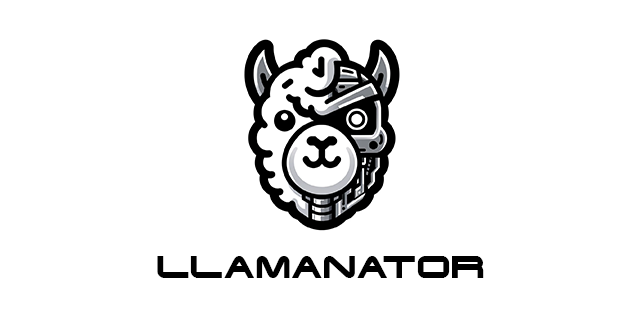

# Llamanator

*Alright, listen. The Large Language Model is an information processing unit: part artificial intelligence, part vast database. Underneath, it's a complex algorithmic framework, data-driven. Highly sophisticated; incredibly versatile. But outside, it appears as intuitive and responsive text: words, sentences, paragraphs, stories - designed for human interaction. **- Kyle Reese - Terminator 2: Judgement Day (adapted obviously...)***

---

## Table of Contents
- [Llamanator](#llamanator)
  - [Table of Contents](#table-of-contents)
  - [Llamanator: Simplify Your LLM Integrations 🦙+🤖](#llamanator-simplify-your-llm-integrations-)
  - [Getting Started](#getting-started)
  - [Before You Begin](#before-you-begin)
  - [Services](#services)
    - [Dockerized LLM Tools](#dockerized-llm-tools)
  - [Installation](#installation)
  - [Primary Project Sponsors:](#primary-project-sponsors)
    - [HighSide.ai](#highsideai)
    - [AlphaBravo](#alphabravo)

## Llamanator: Simplify Your LLM Integrations 🦙+🤖

**Introduction:**

As Large Language Models (LLMs) and Transformers become central to AI and machine learning applications, the challenge of effectively utilizing these powerful tools across various domains persists.

**Llamanator** addresses this by providing a platform for integrating multiple open source LLM tools that can run as Docker containers. This approach simplifies the deployment and management of LLMs for diverse applications, whether hosted locally or on private servers.

**Features:**

- **Docker Container Support**: Llamanator is built with Docker and containerization in mind, enabling easy deployment and scalability of LLM tools as Docker containers. This ensures compatibility and ease of use across different environments. All of the services here are designed to be run as containers.
- **Flexible Hosting Options**: Catering to the need for privacy, security, and scalability, Llamanator supports both local and private cloud hosting for your Dockerized LLM tools.
- **Multi Tool Integration**: The project facilitates seamless integration with multiple open source tools leveraging LLMs for tasks such as inferencing, text generation, and Retrieval Augmented Generation (RAG).
- **Privacy and Security Focus**: With an emphasis on data privacy, Llamanator helps ensure your data remains under your control, ideal for projects handling sensitive information or requiring stringent compliance.
- **Community-Driven Development**: Llamanator thrives on contributions from the developer community, encouraging the addition of new Dockerized tool integrations, feature enhancements, and feedback to foster continuous improvement.

## Getting Started

The Llamanator project is a collection of the work of many other dedicated open-source developers. We will provide examples of how to use the tools and services provided here, but the primary focus is on the integration of these tools into a single deployable platform.

**IMPORTANT**
If you like the work of any of the projects included here, please consider supporting them. They are the ones doing much of the hard work and we are trying to make it easier to deploy and use their tools in a wholistic way. Drop them a star on GitHub, contribute, and consider financially supporting their projects.

The following sections will provide a brief overview of the tools and services provided here, as well as how to get started with the project.

## Before You Begin

It is important to understand deploying this entire project can be complex at times, so we have provided clear instructions on how to deploy each service individually or as a stack.

We do recommend a GPU for faster inferencing and vector processing, but it is not required. We also recommend a minimum of 16GB of RAM and 8 CPU cores for the full stack deployment.

## Services

There are numerous services included in Llamanator. Each of these services is designed to be run as a Docker container.

The full list of the services and links included in Llamanator can be found [here](./services.md).

### Dockerized LLM Tools
- [x] **Llamanator Run**
  - [x] Ollama
- [x] **Llamanator Chat**
  - [x] Open WebUI
- [x] **Llamanator RAG**
  - [x] Dialoqbase

## Installation

The following are the current available installations for the Llamanator project:

- Installation of Llamanator-Bash (April 2024): [Llamanator Bash](./deploy/llamanator-bash/README.md)

---

## Primary Project Sponsors:

### HighSide.ai

- **Website:** [https://highside.ai](https://highside.ai/)
- **About:** HighSide.ai is a company that provides a wide range of scalable AI services to the US Government and DoD. From privately AI applications to secure LLM inferencing and ML training environments, HighSide.ai is a leader in secure AI.

---

### AlphaBravo

- **Website:** [http://alphabravo.io](https://alphabravo.io/)
- **About:** AlphaBravo is a SDVOSB (Service Disabled Veteran Owned Small Business) that provides a wide range of DevSecOps services, software development and training to the US Government and commercial clients.
